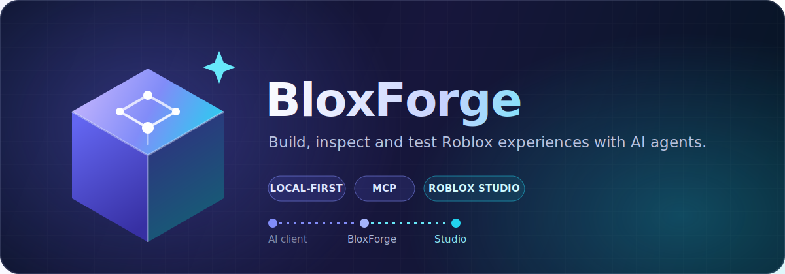

<p align="center">
  
</p>

<div align="center">
  
  <h1>BloxForge</h1>
  <p><strong>A local-first MCP toolkit for Roblox Studio.</strong></p>
  <p>Build, inspect, automate, playtest, and debug Roblox experiences from Claude Code, Codex, Cursor, Gemini, or any MCP-compatible client.</p>

  [](https://github.com/princeofscale/bloxforge/actions/workflows/ci.yml)
  [](https://www.npmjs.com/package/@princeofscale/bloxforge)
  [](https://www.npmjs.com/package/@princeofscale/bloxforge?activeTab=versions)
  [](LICENSE)
  [](https://telegram.me/ro_bloxforge)

  [Quick start](#quick-start) · [Tools](docs/tools-reference.md) · [Troubleshooting](docs/troubleshooting.md) · [Official Telegram](https://telegram.me/ro_bloxforge)
</div>

---

## Why BloxForge?

- **Local-first:** the MCP server and Studio bridge run on your machine; no BloxForge cloud account or remote telemetry.
- **Agent-ready:** inspect scenes, edit Luau, build UI and terrain, run playtests, simulate input, capture logs, and diagnose failures.
- **Safe by default:** destructive actions use confirmation gates, dry runs, backups, limits, and rollback-friendly workflows.
- **Flexible:** choose a token-lean tool profile or load the full toolkit when the task needs it.
- **Open source:** MIT licensed, with no paid tier.

## Quick start

### 1. Enable Studio HTTP requests

In Roblox Studio, open **Game Settings → Security** and enable **Allow HTTP Requests**.

### 2. Add BloxForge to your AI client

```bash
# Claude Code
claude mcp add bloxforge -- npx -y @princeofscale/bloxforge@latest --auto-install-plugin

# Codex CLI
codex mcp add bloxforge -- npx -y @princeofscale/bloxforge@latest --auto-install-plugin

# Gemini CLI
gemini mcp add bloxforge npx --trust -- -y @princeofscale/bloxforge@latest --auto-install-plugin
```

Cursor users can add the same command to `.cursor/mcp.json`:

```json
{
  "mcpServers": {
    "bloxforge": {
      "command": "npx",
      "args": ["-y", "@princeofscale/bloxforge@latest", "--auto-install-plugin"]
    }
  }
}
```

Use `@next` instead of `@latest` to test the current release candidate.

> Fully close and reopen Roblox Studio after the plugin is first installed or updated.

### 3. Verify the connection

Start the configured MCP client, open Studio, then run:

```bash
npx -y @princeofscale/bloxforge@latest verify
```

## What you can automate

| Workflow | Examples |
|---|---|
| Inspect | Query the instance tree, properties, scripts, tags, attributes, and dependencies |
| Build | Create instances, UI, terrain, lighting, templates, and reusable models |
| Edit Luau | Read, patch, search, validate, and safely replace script source |
| Test | Start playtests, simulate input, run assertions, and compare episodes |
| Debug | Capture runtime logs, diagnostics, screenshots, memory, and profiler data |
| Integrate | Import/export builds, sync local files, upload assets, and record provenance |

A useful first prompt:

> Inspect this place, build a six-stage obby with checkpoints and a timer, run a playtest, then fix any runtime errors.

## Tool profiles

Select a profile with `--profile <name>` or `BLOXFORGE_TOOL_PROFILE`:

| Profile | Purpose |
|---|---|
| `core` | Inspection, scripts, and essential editing; token-lean default |
| `builder` | UI, terrain, templates, assets, and scene construction |
| `tester` | Runtime debugging, playtesting, input, and assertions |
| `full` | Every available tool |
| `inspector` | Read-only inspection through `@princeofscale/bloxforge-inspector` |

## Optional Open Cloud access

Most features need no Roblox credentials. Asset uploads and Creator Store access require an optional [Open Cloud API key](https://create.roblox.com/dashboard/credentials?activeTab=ApiKeysTab) with `asset:read` and `asset:write`:

```bash
export ROBLOX_OPEN_CLOUD_API_KEY="your-api-key"
```

Never commit this key or place it in MCP configuration shared with others.

## Documentation

- [Tool reference](docs/tools-reference.md)
- [Architecture](docs/architecture.md)
- [Known limitations](docs/known-limitations.md)
- [Troubleshooting](docs/troubleshooting.md)
- [Security policy](SECURITY.md)

## Community

News, release notes, and project discussion are published in the [official BloxForge Telegram channel](https://telegram.me/ro_bloxforge).

Bug reports and feature requests belong in [GitHub Issues](https://github.com/princeofscale/bloxforge/issues).

## License

[MIT](LICENSE) © BloxForge contributors.
