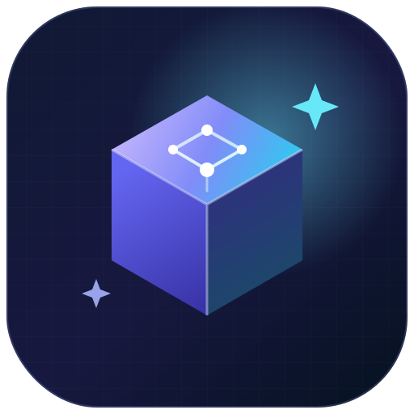

<div align="center">
  <picture>
    <source media="(prefers-color-scheme: dark)" srcset="assets/logo.svg">
    <source media="(prefers-color-scheme: light)" srcset="assets/logo.svg">
    
  </picture>
  <h1 align="center">BloxForge</h1>
  <p align="center">
    <strong>Open-source AI agent toolkit for Roblox Studio.</strong><br />
    Build, inspect, test, and automate Roblox games locally with AI.<br />
    <em>Roblox Studio MCP · Claude Code · Codex · Cursor · Gemini · Any MCP-compatible AI client</em>
  </p>

  [](https://github.com/princeofscale/bloxforge/actions/workflows/ci.yml)
  [](https://www.npmjs.com/package/@princeofscale/bloxforge)
  [](LICENSE)
</div>

---

**BloxForge** connects AI agents to Roblox Studio locally. It empowers creators and developers to build games, refactor code, run playtests, and diagnose runtime errors directly from AI clients.

### For whom is it intended?
- **Roblox Developers** who want to accelerate scaffolding, UI creation, and bulk changes.
- **AI Tool Users** wanting a local-first, private-by-default, and free-to-use bridge to Roblox Studio.

### What can you do with it?
- **Scene Inspection**: Query instances, properties, and tree structures in a token-efficient manner.
- **Luau Scripting & Edits**: Read, write, and patch scripts safely with automatic backups.
- **Live Playtests & Assertions**: Run playtests, monitor runtime output, simulate input, and run gameplay assertions.
- **Scaffolding & Templates**: Scaffold levels, build environment layouts, and generate basic gameplay loops.

### Why trust BloxForge?
- **Local-first, private by default**: No cloud accounts or telemetry. Data never leaves your machine.
- **Safety controls**: Confirms destructive actions, supports dry-runs, keeps automatic backups, and enforces resource limits.
- **MIT Licensed**: Completely free and open-source, with no hidden pro tiers.

---

## See it in action
*(Demo video / GIF placeholder)*

---

## Quick start

### 1. Enable Allow HTTP Requests
In Roblox Studio, go to **Game Settings** → **Security** and enable **Allow HTTP Requests**.

### 2. Connect your AI client
Run one of the following commands depending on your AI client:

```bash
# Claude Code
claude mcp add bloxforge -- npx -y @princeofscale/bloxforge@latest --auto-install-plugin

# Codex CLI
codex mcp add bloxforge -- npx -y @princeofscale/bloxforge@latest --auto-install-plugin

# Gemini CLI
gemini mcp add bloxforge npx --trust -- -y @princeofscale/bloxforge@latest --auto-install-plugin

# Cursor
# Add to your .cursor/mcp.json:
# "bloxforge": {
#   "command": "npx",
#   "args": ["-y", "@princeofscale/bloxforge@latest", "--auto-install-plugin"]
# }
```

> **Note**: Fully close and reopen **Roblox Studio** after the plugin is first installed or updated.

### 3. Verify connection
Run the diagnostics check to confirm your environment is ready:
```bash
npx -y @princeofscale/bloxforge@latest verify
```

---

## Core workflows

Here is a common scenario to try:
> Build a six-stage obby, add checkpoints and a timer, run a playtest, and fix runtime errors.

- **Understand an existing game**: Inspect hierarchies, search objects, and read current scripts.
- **Build a feature**: Create layouts, write Luau scripts, and apply environment modifications.
- **Test it in play mode**: Start/stop playtests, capture logs, and run assertions.
- **Review, apply, and revert**: Preview changes with dry-runs and restore previous states using backups.

---

## Configurable tool profiles

You can preload specific subsets of tools with `--profile <name>` (or by setting `BLOXFORGE_TOOL_PROFILE`):

| Profile | Purpose |
|---|---|
| `core` | Inspection, scripts, and essential editing; token-lean default |
| `builder` | UI, terrain, templates, and asset creation |
| `tester` | Runtime debugging, playtesting, and assertions |
| `full` | All available tools |
| `inspector` | Read-only inspection package |

---

## Why BloxForge?

- **MIT Licensed**: Free to use, modify, and distribute.
- **Configurable Tool Profiles**: Tailor the context window size and token costs.
- **Self-Hosted & Private**: Runs locally on your machine.
- **Inspector-Only Variant**: Safe browsing with zero mutation risk.
- **Safety First**: Dry-runs, backups, undo/redo, and transaction rollbacks.
- **Evaluation Harness**: Built-in benchmark suite to verify agent behavior.

### Differences from Roblox Studio MCP (official)
Official MCP is designed for basic integration. BloxForge is a comprehensive, production-ready toolkit focusing on:
- Extensive scaffolding tools (UI, terrain, gameplay templates).
- Advanced safety gates (backups, dry-runs, and limits).
- Seamless multiplayer test management and runtime assertions.
- CC0 asset discovery and local sync.

---

## Getting an Open Cloud API key

For asset uploads and Creator Store access, you can optionally configure a Roblox Open Cloud API key (everything else works key-free):
1. Go to the [Creator Dashboard → Credentials → API Keys](https://create.roblox.com/dashboard/credentials?activeTab=ApiKeysTab).
2. Create an API Key with **Assets** (`asset:read`, `asset:write`) permissions.
3. Expose the key:
   ```bash
   export ROBLOX_OPEN_CLOUD_API_KEY="your-api-key"
   ```
*See [docs/README.md](docs/README.md) for detailed configuration options.*

---

## Roadmap

- [x] Agent evaluation harness
- [ ] Canonical benchmark place
- [ ] Reproducible public benchmark reports
- [ ] Cross-model benchmark runs
- [ ] Interactive approval UI
- [ ] Rich object diff preview
- [ ] Example games built and tested with BloxForge

---

## Troubleshooting

| Symptom | Fix |
|---|---|
| Plugin never shows "Connected" | Enable **Allow HTTP Requests** and fully restart Studio. |
| verify says nothing on port | Start your MCP client first to spin up the server. |
| Version mismatch banner | Re-run connection command with `--auto-install-plugin` and restart Studio. |
| Tool call hangs | Multiple places connected; pass `instance_id` to target a specific window. |

For detailed guides, see the [documentation](docs/README.md).
