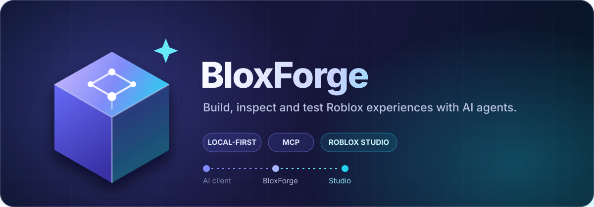
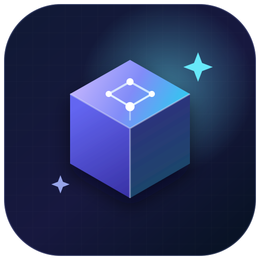

<p align="center">
  
</p>

<div align="center">
  
  <h1>BloxForge</h1>
  <p><strong>Give AI coding agents a safe, local interface to Roblox Studio.</strong></p>
  <p>Inspect places, edit Luau, build worlds, run playtests, and debug live sessions from any MCP-compatible client.</p>

  [](https://github.com/princeofscale/bloxforge/actions/workflows/ci.yml)
  [](https://www.npmjs.com/package/@princeofscale/bloxforge)
  [](https://www.npmjs.com/package/@princeofscale/bloxforge)
  [](https://nodejs.org/)
  [](LICENSE)

  [Get started](#quick-start) · [Explore tools](docs/tools-reference.md) · [Troubleshoot](docs/troubleshooting.md) · [Telegram](https://telegram.me/ro_bloxforge)
</div>

---

## Roblox Studio, controlled by your agent

BloxForge connects an MCP client to a lightweight Studio plugin over localhost:

```text
Claude Code / Codex / Cursor / Gemini
                  ↕ MCP
          BloxForge Node server
                  ↕ localhost
          Roblox Studio plugin
```

No BloxForge cloud account is required. Your place data and bridge traffic stay
on your machine.

| | What BloxForge provides |
|---|---|
| **Build** | Instances, UI, terrain, lighting, templates, reusable models, and generated scenes |
| **Code** | Read, search, patch, validate, and safely replace Luau source |
| **Test** | Playtests, simulated input, gameplay assertions, screenshots, and episode comparison |
| **Debug** | Runtime logs, transport diagnostics, memory data, breakpoints, and profiler captures |
| **Integrate** | Rojo-aware project tools, imports/exports, asset workflows, and provenance records |
| **Protect** | Localhost binding, scoped capabilities, confirmation gates, dry runs, limits, and recovery |

## Quick start

Requires Node.js 20 or newer.

### 1. Allow Studio HTTP requests

In Roblox Studio, open **Game Settings → Security** and enable
**Allow HTTP Requests**.

### 2. Install the Studio plugin

Run this once, and again whenever you update BloxForge:

```bash
npx -y @princeofscale/bloxforge@latest --install-plugin
```

Fully close and reopen Roblox Studio after installing or updating the plugin.

### 3. Connect your MCP client

<details open>
<summary><strong>Claude Code</strong></summary>

```bash
claude mcp add bloxforge -- npx -y @princeofscale/bloxforge@latest
```

</details>

<details>
<summary><strong>Codex CLI</strong></summary>

```bash
codex mcp add bloxforge -- npx -y @princeofscale/bloxforge@latest
```

</details>

<details>
<summary><strong>Gemini CLI</strong></summary>

```bash
gemini mcp add bloxforge npx --trust -- -y @princeofscale/bloxforge@latest
```

</details>

<details>
<summary><strong>Cursor</strong></summary>

Add this to `.cursor/mcp.json`:

```json
{
  "mcpServers": {
    "bloxforge": {
      "command": "npx",
      "args": ["-y", "@princeofscale/bloxforge@latest"]
    }
  }
}
```

</details>

Use `@next` instead of `@latest` to test release candidates.

> MCP clients normally start BloxForge before Roblox Studio. The message
> `Waiting for Studio plugin to connect...` means the server is healthy and
> idle. Open a Studio project whenever you are ready.

### 4. Verify everything

Start your MCP client, open a place in Studio, and run:

```bash
npx -y @princeofscale/bloxforge@latest verify
```

## Try it

Start with a focused request:

> Inspect this place, summarize its architecture, identify runtime risks, and
> propose a safe implementation plan before changing anything.

Or let the agent execute an end-to-end workflow:

> Build a six-stage obby with checkpoints and a timer, playtest it, inspect the
> runtime logs, and fix any errors you find.

## Choose the right tool profile

Profiles keep tool discovery focused and reduce context use:

| Profile | Best for |
|---|---|
| `core` | Everyday inspection, scripts, and essential editing — the default discovery set |
| `builder` | UI, terrain, templates, assets, and scene construction; arbitrary Luau execution denied |
| `tester` | Playtests, runtime debugging, input simulation, and assertions |
| `full` | Every available BloxForge tool |
| `inspector` | Read-only authorization; the dedicated `@princeofscale/bloxforge-inspector` also omits write definitions |

Select one with `--profile <name>` or `BLOXFORGE_TOOL_PROFILE`.
Profiles control authorization where stated; `load_toolset` only expands
schema visibility and cannot grant a denied tool. Invalid names fail startup.

## Reliability and safety

BloxForge treats Studio as a recoverable local execution target:

- request acknowledgements, delivery leases, deduplication, and status lookup;
- safe retry rules that distinguish reads from mutations;
- explicit `outcome_unknown` handling after interrupted operations;
- bounded atomic recovery journals and payload-free p50/p95/p99 diagnostics;
- authenticated proxy forwarding with queryable primary request IDs;
- per-DataModel concurrency limits and backpressure;
- plugin session credentials and capability-scoped MCP clients;
- localhost-only bridge binding by default, with authenticated non-loopback opt-in;
- mutation confirmation, dry-run, backup, and rollback-oriented tools.

See [Architecture](docs/architecture.md) and
[Security policy](SECURITY.md) for the full model.

## Optional Roblox Open Cloud access

Most features need no Roblox credentials. Creator Store access and asset
uploads can use an optional
[Open Cloud API key](https://create.roblox.com/dashboard/credentials?activeTab=ApiKeysTab)
with the required asset scopes:

```bash
export ROBLOX_OPEN_CLOUD_API_KEY="your-api-key"
```

Never commit the key or place it in shared MCP configuration.

## Develop locally

```bash
npm ci
npm run build:all
npm test
npm run lint
```

Plugin builds only write repository artifacts. Set `MCP_PLUGINS_DIR` to an
explicit temporary directory when testing installation; builds never infer or
modify your normal Studio plugin directory.

Useful release checks:

```bash
npm run test:plugin:smoke
npm run test:plugin:installer
npm run docs:check
npm run verify-package
```

## Documentation

- [Tool reference](docs/tools-reference.md)
- [Architecture](docs/architecture.md)
- [Known limitations](docs/known-limitations.md)
- [Troubleshooting](docs/troubleshooting.md)
- [Security policy](SECURITY.md)
- [Changelog](CHANGELOG.md)

## Community

- Releases and project news: [official Telegram channel](https://telegram.me/ro_bloxforge)
- Bugs and feature requests: [GitHub Issues](https://github.com/princeofscale/bloxforge/issues)
- Security reports: follow the private process in [SECURITY.md](SECURITY.md)

## License

[MIT](LICENSE) © BloxForge contributors.
